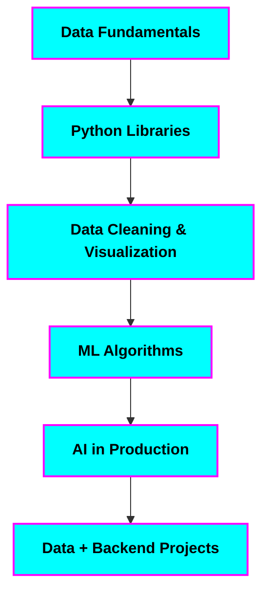

<div align="center">
  
</div>

---

## 🌌 About Me

> Full-stack developer orbiting the **backend galaxy**, with gravity pulling toward **data & AI**.  
> Merging **Python + Data Science + AI/ML** with production-grade web apps.  

- 💳 **Building:** [Credible](#) – A full-stack Credit Card Management System  
- 📊 **Exploring:** NumPy • Pandas • Matplotlib • scikit-learn  
- 🧠 **Learning next:** AI/ML fundamentals → real-world integrations  
- 🛠 **Core stack:** React • Node.js • Express • PostgreSQL • Prisma • TailwindCSS  
- 🎯 2025 Goal: Deliver projects where **backend, data, and AI** converge

---

## ⚡ Featured Projects

| Project | Tech Stack | Description |
| --- | --- | --- |
| **Credible** | React, Tailwind, Node.js, Express, PostgreSQL, Prisma, JWT | Track credit cards, lounge credits, billing cycles. |
| **Data Playground** | Python, NumPy, Pandas, Matplotlib | Sandbox for analytics experiments. |
| **AI/ML Labs** | Python, scikit-learn | Learning ML by building small, focused models. |

---

## 🛠 Tech & Tools

<div>
  <!-- Backend -->
    
  <!-- Frontend -->
    
  <!-- Data / AI -->
    
   
   
   
</div>

---

## 📊 Stats & Activity

<div align="center">


</div>

> 💡 *Top languages reflect public repos, not skill level.*

---

## 🌱 Learning Path



## 🎧 Vibe While Coding
<div align="center">  </div>  ```
